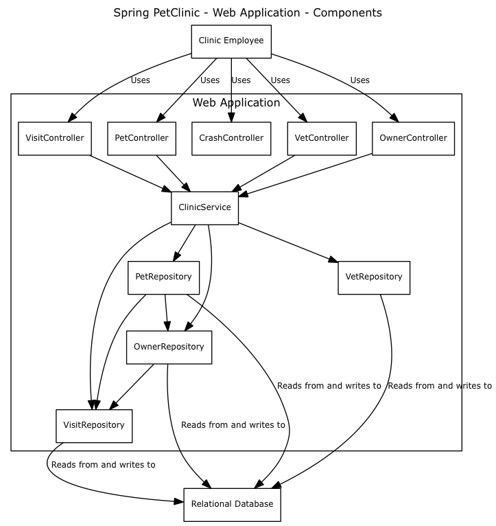

# Graphviz and DOT

Structurizr for Java also includes the ```structurizr-dot``` library, which in turn uses Cyrille Martraire's [dot-diagram library](https://github.com/cyriux/dot-diagram) to create DOT (graph description language) files that can be imported into the [graphviz tool](http://www.graphviz.org).

The [DotWriter](https://github.com/structurizr/java/blob/master/structurizr-dot/src/com/structurizr/io/dot/DotWriter.java) class takes a workspace and creates a graph for each view in that workspace. For example:

```java
Workspace workspace = ...

DotWriter dotWriter = new DotWriter();
StringWriter stringWriter = new StringWriter();
dotWriter.write(workspace, stringWriter);
System.out.println(stringWriter);

```

> You will need Graphviz installed.

As an example, the graph for the [Spring PetClinic component diagram](https://structurizr.com/public/1#components) looks like this.

```
# Class diagram Spring PetClinic - Web Application - Components
digraph G {
	graph [labelloc=top,label="Spring PetClinic - Web Application - Components",fontname="Verdana",fontsize=12];
	edge [fontname="Verdana",fontsize=9,labelfontname="Verdana",labelfontsize=9];
	node [fontname="Verdana",fontsize=9,shape=record];
subgraph cluster_c0 {
label = "Web Application";
	c1 [label="VisitController"]
	c10 [label="PetController"]
	c11 [label="CrashController"]
	c12 [label="VetController"]
	c2 [label="OwnerController"]
	c3 [label="ClinicService"]
	c4 [label="VetRepository"]
	c5 [label="PetRepository"]
	c6 [label="OwnerRepository"]
	c7 [label="VisitRepository"]
}
	c8 [label="Clinic Employee"]
	c9 [label="Relational Database"]
	// null
	c5 -> c6 [];
	// null
	c3 -> c4 [];
	// null
	c7 -> c9 [label="Reads from and writes to"  , ];
	// null
	c3 -> c5 [];
	// null
	c3 -> c6 [];
	// null
	c5 -> c9 [label="Reads from and writes to"  , ];
	// null
	c3 -> c7 [];
	// null
	c6 -> c9 [label="Reads from and writes to"  , ];
	// null
	c5 -> c7 [];
	// null
	c6 -> c7 [];
	// null
	c4 -> c9 [label="Reads from and writes to"  , ];
	// null
	c8 -> c12 [label="Uses"  , ];
	// null
	c10 -> c3 [];
	// null
	c12 -> c3 [];
	// null
	c8 -> c10 [label="Uses"  , ];
	// null
	c8 -> c11 [label="Uses"  , ];
	// null
	c8 -> c2 [label="Uses"  , ];
	// null
	c8 -> c1 [label="Uses"  , ];
	// null
	c1 -> c3 [];
	// null
	c2 -> c3 [];
}
```

Importing this graph definition into graphviz (or [GraphvizFiddle](https://stamm-wilbrandt.de/GraphvizFiddle/)) gives you the following image:

